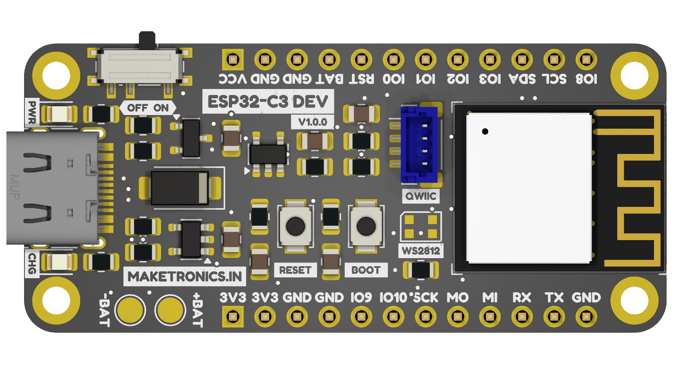
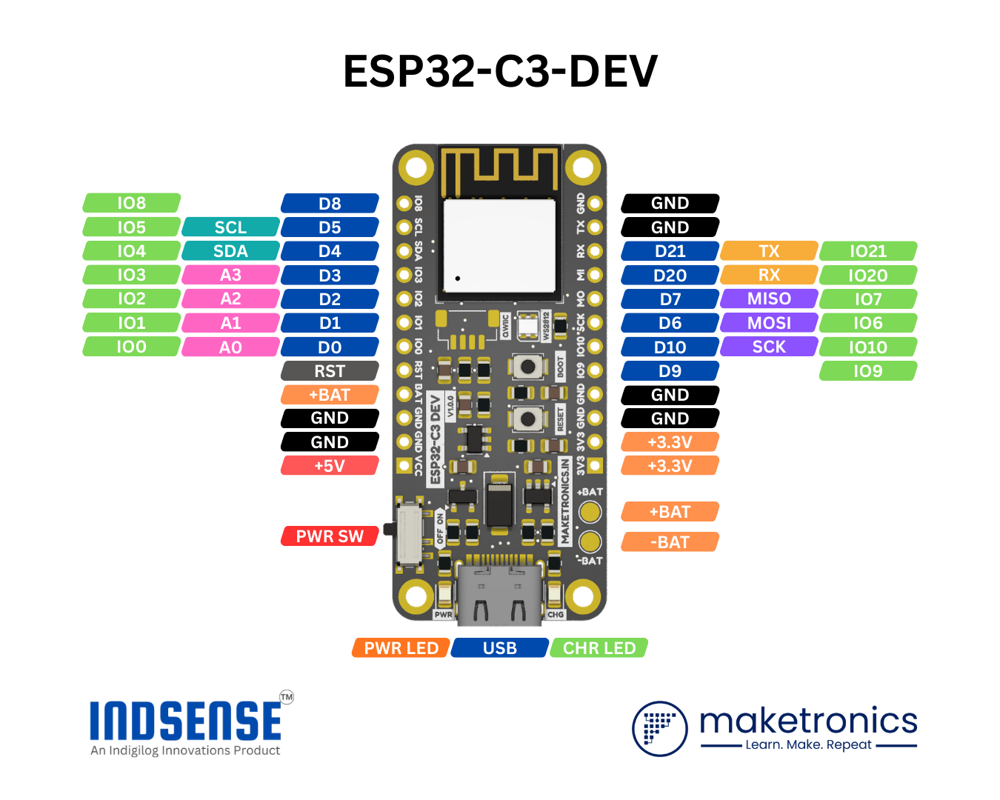

---
distributors:
  - name: Maketronics
    url: https://maketronics.in/product/a7672s-modem-pro-without-gnss-and-ble-industrial-grade-a7672s-lasc/
    logo: ./assets/images/maketronics_logo.png  

  - name: Robu.in
    url: https://robu.in/product/indsense-a7672s-industrial-modem-4g-lte-cat-1/
    logo: ./assets/images/robu_logo.png
---

# ESP32-C3-DEV

## Introduction  

The ESP32-C3 Development Board is a compact and versatile IoT development platform designed for rapid prototyping, embedded system development, and wireless applications. Built around the **ESP32-C3 Wi-Fi and Bluetooth Low Energy microcontroller**, this board provides reliable wireless connectivity, low power consumption, and an easy-to-use interface for developers, makers, and engineers.

The board integrates essential hardware components such as a **USB Type-C interface for power and programming, on-board voltage regulation, battery charging circuitry, and GPIO breakout pins**, enabling seamless integration into IoT devices, automation systems, and smart electronics projects.

Its **breadboard-friendly** form factor and clearly labeled GPIO pins make it ideal for both beginners and advanced developers working with the **ESP-IDF, Arduino, or other ESP32** compatible development frameworks.

## Key Features

#### ESP32-C3 Wi-Fi + BLE SoC
- 2.4 GHz Wi-Fi (802.11 b/g/n)
- Bluetooth Low Energy (BLE 5)
- RISC-V 32-bit single-core processor

#### USB Type-C Interface
- Programming and power through USB
- Easy connection to PC or USB power adapter

#### Integrated Battery Support
- Li-ion / Li-Po battery connector pads (`+BAT` / `-BAT`)
- On-board battery charging circuitry

#### Power Management
- On-board voltage regulator
- Power switch for convenient operation

#### User Interface
- **BOOT** button for entering firmware flashing mode
- **RESET** button for restarting the device
- Power and charging status indicator LEDs

#### Expansion Friendly
- Fully exposed GPIO pins
- Breadboard compatible form factor
- Supports common peripherals:
  - UART
  - SPI
  - I²C
  - ADC
  - PWM

## Pinout

### Pinout Description

| PIN       | Description                   |
| --------- | ----------------------------- |
| 5V - 24V  | Input power pin. 5V to 24V DC |
| GND       | Ground Pin                    |
| VDD       | MCU Voltage                   |
| RXD       | UART Receiver Pin             |
| TXD       | UART Transmitor Pin           |
| RESET     | Module Reset Pin              |
| POWER KEY | Module Power Key Pin          |

## Interfacing with MCU

| A7672S-MODEM-PRO PIN | MCU PIN              |
| -------------------- | -------------------- |
| VDD                  | MCU Power Supply Pin |
| RXD                  | MCU UART TX Pin      |
| TXD                  | MCU UART RX Pin      |

!!! warning "Logic Level Reference"
    For proper **UART logic level compatibility**, connect the module’s **VDD** and **GND** pins to the MCU’s corresponding **power supply and ground reference**.

## Power Supply

The module supports a **wide input voltage range of 5 V to 24 V DC** and must be powered through the **pin header power input**. 

**Powering the module via the USB port is not supported** and may result in improper operation.

!!! warning "Power Polarity"
    This module **does not include reverse polarity protection**. Ensure correct power supply polarity before connection. Applying reverse voltage may cause permanent damage to the module.

## Powering the Module ON

The module can be powered ON using either of the following methods:

### 1. PWR KEY Control

The module can be turned ON by controlling the **PWR KEY** pin using an MCU GPIO.  

To power ON the module, **pull the PWR KEY pin HIGH for the required duration** (refer to the module timing specifications), then release it.

This method allows the MCU to:

  - Programmatically control power ON and OFF
  - Implement power-saving and reset strategies
  - Monitor and manage modem state

### 2. Auto Power ON (Solder Jumper)

The module also supports **automatic power ON**. By **closing the dedicated solder jumper on the back side of the PCB**, the PWR KEY signal is asserted automatically when power is applied.

When auto power ON is enabled:

  - The module powers ON immediately after Power is applied
  - MCU control of the PWR KEY is not required
  - Suitable for simple or standalone deployments

!!! note
    Only one power-on method should be used at a time. If auto power ON is enabled via the solder jumper, ensure the MCU GPIO connected to PWR KEY is disconnected or not actively driven.

## Module Status LEDs

The module provides onboard LEDs to indicate **power**, **network**, and **GNSS timing** status.

### Status LED

The **STATUS** LED indicates the power state of the module.

- **ON**: Module is powered ON and operating
- **OFF**: Module is powered OFF

### Network LED (NET)

The **NET** LED indicates the current cellular network status of the module.

| NET LED Behavior       | Module Status                                                            |
| ---------------------- | ------------------------------------------------------------------------ |
| Always ON              | Searching for cellular network                                           |
| 200 ms ON / 200 ms OFF | Registered on network or data transmission in progress                   |
| OFF                    | Module powered OFF, or in sleep mode (`AT+CSCLK=1`) with DTR pulled HIGH |

### 1PPS LED

The **1PPS** LED indicates the **GNSS one-pulse-per-second (1PPS)** timing signal.

- Blinks once per second when GNSS is active and a valid timing signal is available
- OFF when GNSS is disabled or no valid GNSS fix is available

!!! note
    The **1PPS LED** is available **only on the A7672S-MODEM-PRO-G variant**.

## **Where to BUY?**