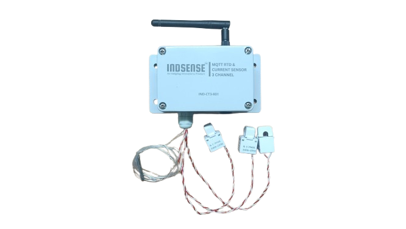

## 🔑 Key Features  

- **Industrial-Grade Protection:**  
  Engineered for harsh industrial environments, ensuring robust performance, safety, and durability.

- **Three Independent Current Sensors:**  
  Accurate measurement across three separate channels, supporting a wide range of monitoring applications.

- **Built-in Captive Portal for Effortless Configuration:**  
  Simplified device setup and network configuration through an intuitive captive portal — no additional software required.

- **Secure Communication with SSL Encryption:**  
  Supports SSL certificate-based encryption and authentication for secure, encrypted MQTT communication.

## 📊 Specifications

| **Parameter**               | **Details**                                                          |
|-----------------------------|----------------------------------------------------------------------|
| **Operating Voltage**       | 5V DC                                                                |
| **Communication Interface** | Wi-Fi (2.4 GHz)                                                      |
| **Communication Protocol**  | MQTT (Supports SSL/TLS encryption)                                   |
| **Indicators**              | Multi-color LED indicators for Wi-Fi status, MQTT status, and errors |
| **Sensor Channels**         | 3 Independent Current Sensors 1 RTD Temperature Sensor           |
| **Configuration**           | Captive Portal for network and MQTT setup                            |
| **Security**                | SSL Certificate-based authentication and encryption                  |
| **Dimensions**              | 130x130x50mm (WxHxD)                                                 |
| **Operating Temperature**   | -40°C to +85°C  (or -40°F to +185°F)                                 |
