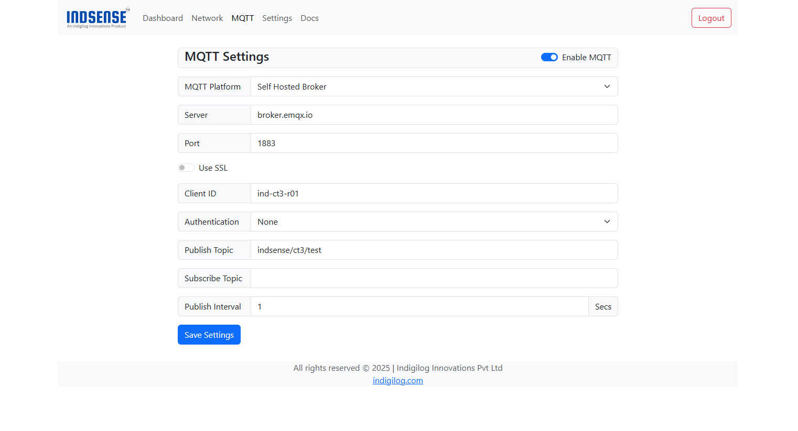
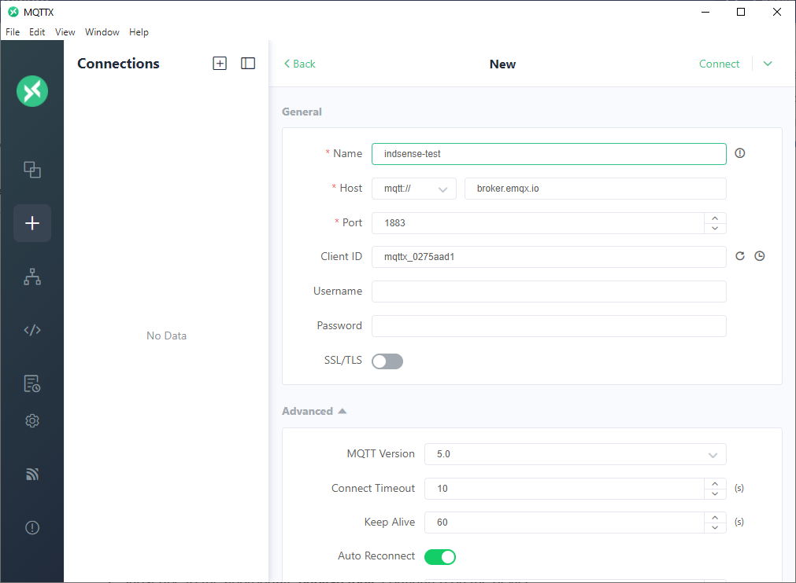
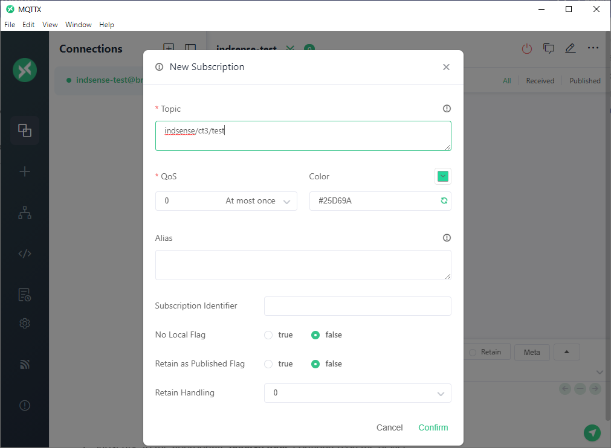
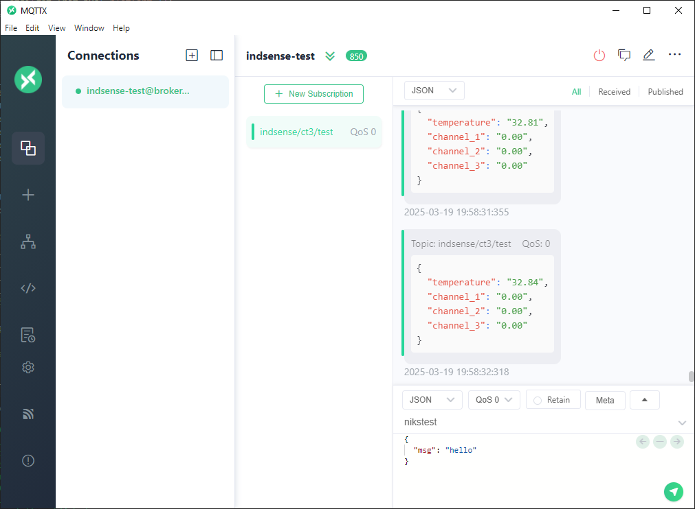

# Testing IND-CT3-xxx with EMQX Public Broker

This section demonstrates how to test the **IND-CT3-xxx** device using the publicly available **EMQX Broker** and monitor real-time data with the **MQTTX desktop client**.

---

## ✅ Pre-requisites

1. **Indsense MQTT-enabled device** (e.g., **IND-CT3-xxx**)
2. **MQTTX desktop client** (or any MQTT client of your choice)

---

## 🌐 MQTT Broker Configuration

Configure your device with the following public broker details:

````ini
[MQTT Broker Details]
Server               = broker.emqx.io
TCP Port             = 1883
WebSocket Port       = 8083
SSL/TLS Port         = 8883
Secure WebSocket Port= 8084
````

---

## 🚀 Preparing the Device

1. Access the device’s captive portal.
2. Navigate to the **MQTT Settings** page.
3. Enter the **EMQX broker details** as provided above.
4. Enable MQTT and configure additional parameters like Client ID, topics, etc., as described in the [Connecting to MQTT Broker](mqtt_conn.md) section.

Once configured, the final setup should appear similar to the image below:



---

## 📊 Viewing Data on MQTTX

1. Open **MQTTX** and create a new connection using the same broker details.
    
2. Subscribe to the appropriate **publish topic** configured on the device.
    
3. Monitor the live sensor data streamed from the **IND-CT3-xxx** device.
    

---
