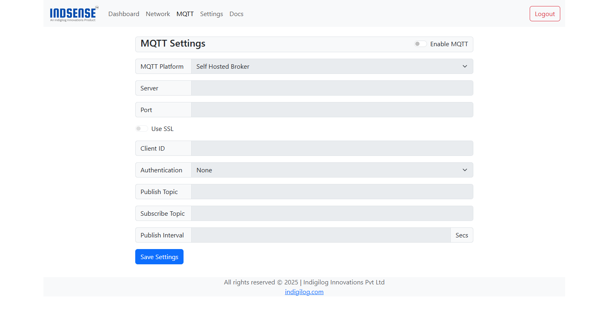

# Connecting to MQTT Broker

This section guides you through connecting the device to an MQTT broker to enable sensor data publishing.

---

## 🏠 Connecting to a Self-Hosted Broker

Follow these steps to connect your device to a self-hosted MQTT broker:

1. **Log in** to the device's captive portal.
2. Navigate to the **MQTT** settings page.
3. By default, MQTT functionality is disabled.  
   Toggle the **Enable MQTT** switch to **ON** to activate configuration fields.
    
4. Set **MQTT Platform** to **Self-Hosted Broker**.
5. Enter the **Broker Server Address** and **Port Number**.
6. (Optional) For secure communication:
    - Enable **Use SSL**.
    - Upload the **Server SSL Certificate**.
7. Provide a unique **Client ID** for the device.  
   > 🔑 *Ensure each device has a distinct Client ID to avoid conflicts.*
8. If your broker requires authentication:
    - Select the **Authentication Method**.
    - Enter the **Username** and **Password** or upload **Client Cert.** and **Client Key**
9. Specify the **Publish Topic** where sensor data will be sent.
10. (Optional) Enter a **Subscribe Topic** if the device needs to receive commands or messages.
11. Set the **Publish Interval** (in seconds) to define how frequently data is sent to the broker.
12. Click **Save Settings** to establish the connection.

✅ Once connected, the device status LED turns `Solid Green` and start publishing sensor data to the configured broker.

---

## ☁️ Connecting to Anedya.io

To connect to the **Anedya.io** cloud platform:

1. **Log in** to the device's captive portal.
2. Navigate to the **MQTT** settings page.
3. By default, MQTT functionality is disabled.  
   Toggle the **Enable MQTT** switch to **ON** to activate configuration fields.
    
4. Set **MQTT Platform** to **Self-Hosted Broker**.
5. Choose **Anedya.io** as the **MQTT Platform**.
6. Enter the **Broker Server Address** and **Port Number**.
7. (Optional) For secure communication:
    - Enable **Use SSL**.
    - Upload the **Server SSL Certificate**.
8. Enter the **Device ID** and **Connection Key** provided by Anedya.io.
9. Set the **Publish Interval** as desired.
10. Click **Save Settings** to establish the connection.

> 📢 **Note:** For specific setup instructions related to your Anedya.io account, refer to the [Anedya.io documentation](https://anedya.io).

✅ Once connected, your device will automatically start publishing sensor data to the configured broker.

---

