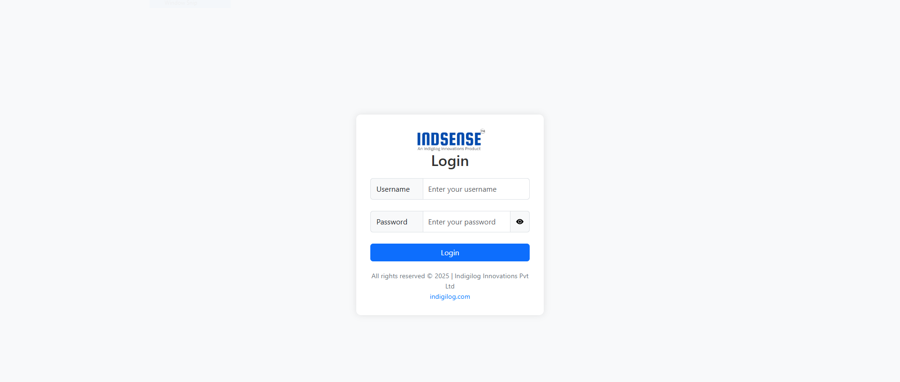
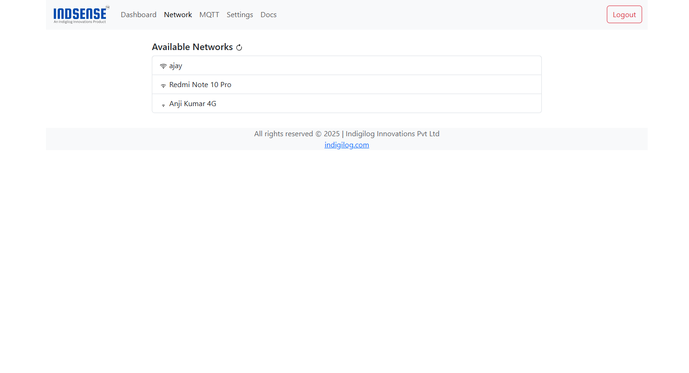
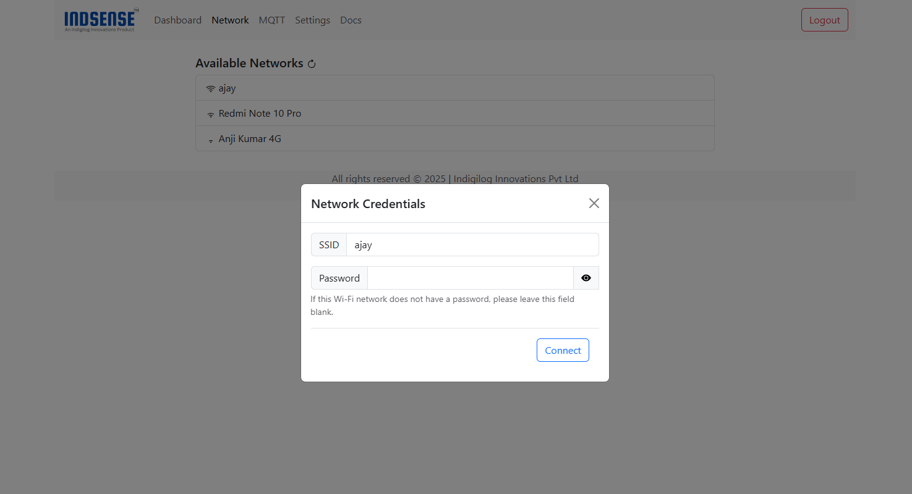

# Connecting to Wi-Fi Network

Connect your device to a Wi-Fi network using the built-in configuration portal. Follow the steps below:

## 📶 Steps to Connect

1. **Check Existing Network Connection**

    - If the device is already connected to a Wi-Fi network:
        - **LED Status:**
            - `Solid Green` → Connected.
            - `Blinking Green every 100ms` → Connected.
    - In this case, refer to [Change Network Connection](#change-network-connection) to update or modify the connection.

2. **Connect to Device Hotspot**

    - On your PC or mobile device, search for the device hotspot SSID (printed on the device label):
        - **SSID:** `ind-xxxxxx`
        - **Default Password:** `12345678`

3. **Access the Captive Portal**

    - The captive portal should automatically open after connecting to the hotspot.
    - **If it doesn’t:**  
      Open a browser and manually enter the portal URL printed on the device label: `ind-xxxxx.local`

4. **Login to Portal**

    - Enter the default login credentials:
     
     
     
      - **Username:** `admin`
      - **Password:** `admin`
     
!!! warning "Change Login Password"
    For security, change the default username and password immediately after logging in.  
    Refer to: [Change Login Password](password.md)

1. **Select Wi-Fi Network**

    - Navigate to the **Network** tab.
    - Available networks will be listed.  
      If your network isn’t visible, click the **Reload** button to scan again.
     
     

2. **Connect to Desired Network**

    - Click on the desired Wi-Fi network.
    - Enter the password when prompted:
      - **Password-Protected Networks:** Enter the password.
      - **Open Networks:** Leave the password field empty.
    - Press **Connect**.
   
    

3. **Confirm Connection**

    - Upon successful connection:
        - **LED Status:** `Blinking Green every 100ms`
    - Connect your PC to the same Wi-Fi network.

4. **Access Device**

    - After connecting to the configured network, click **OK** on the portal.
    - The page will refresh and redirect you to the login page where you can access the device.

---

## 🔄 Change Network Connection

To change the existing network connection:

1. Connect your PC to the network, the device is connected and open the captive portal.
2. Login using your credentials.
3. Navigate to the **Network** tab.
4. Select a new network and enter credentials.
5. Confirm connection and check LED status.

---

## 🏭 Reset to Factory Defaults

!!! warning
    This action will wipe out all the user saved passwords, network credentials and calibration settings
 
To perform a factory reset:

1. Power off the device.
2. Press and hold the **Reset Button**.
3. Power on the device while holding the button for **10 seconds**.
4. Release the button when the LED starts blinking rapidly.
5. The device will reboot and restore default settings.

✅ **After reset:**  
You will need to reconnect to the device hotspot and reconfigure the network and other settings.

---

