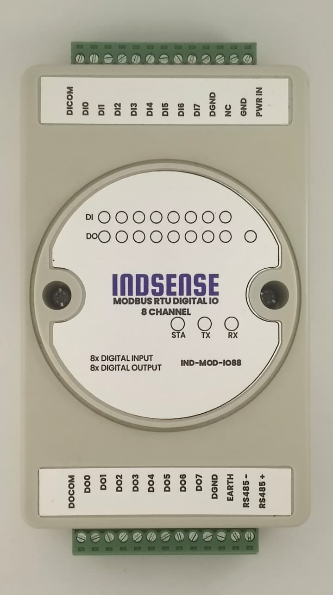

# IND-MOD-IO88

## Electrical Safety

!!! danger "Risk of Electric Shock"

    The IND-MOD-IO88 is intended for use with industrial control systems. Incorrect installation or wiring may result in electric shock, equipment damage, or personal injury.

    - Disconnect all power sources before installing or servicing the module.
    - Verify that the power supply is turned off before making or modifying any wiring connections.
    - Never touch exposed conductors while the system is energized.

!!! warning "Qualified Personnel Only"

    Installation, commissioning, and maintenance of this product must only be performed by qualified personnel familiar with industrial electrical systems and local electrical safety regulations.

!!! warning "Observe Voltage Ratings"

    Ensure that all input voltages, output loads, and power supply connections remain within the specifications provided in this manual. Exceeding the maximum ratings may permanently damage the module.

!!! caution "Wiring"

    - Use appropriately sized wires and tighten terminal screws securely.
    - Verify wiring polarity before applying power.
    - Keep signal wiring separate from high-voltage or high-current cables to reduce electrical noise.

!!! info "Regulatory Compliance"

    Follow all applicable local electrical codes and safety standards when installing and operating the IND-MOD-IO88.

## Introduction  

The **IND-MOD-IO88** is a compact industrial **Modbus RTU 8-channel I/O Module** designed to simplify the integration of digital inputs and outputs into PLC, SCADA, HMI, and Industrial IoT systems. It communicates over the industry-standard **RS-485** interface using the **Modbus RTU** protocol, ensuring reliable interoperability with a wide range of industrial automation equipment.

The module provides **8 opto-isolated digital inputs** and **8 opto-isolated digital outputs**, making it suitable for monitoring field devices such as push buttons, limit switches, proximity sensors, and relay contacts, while simultaneously controlling loads including relays, contactors, indicator lamps, solenoid valves, and other industrial actuators.

Designed for demanding industrial environments, the IND-MOD-IO88 supports both **dry-contact** and **wet-contact (up to 24 VDC)** digital inputs (NPN or PNP) with built-in bidirectional optocoupler and 8 Digital Outputs supports upto 40V, open-drain output, output load 500mA/channel(MAX) allowing seamless integration with a wide variety of sensors and control devices. The robust RS-485 communication interface enables reliable long-distance communication in electrically noisy environments.

Whether used as a distributed remote I/O module, a PLC expansion module, or an interface between field devices and Industrial IoT gateways, the IND-MOD-IO88 offers a cost-effective, reliable, and easy-to-deploy solution for industrial automation applications.

### Key Features

* 8 opto-isolated digital inputs
* Supports both dry-contact and wet-contact inputs (up to 24 VDC)
* 8 opto-isolated digital outputs for controlling external loads
* RS-485 communication with Modbus RTU protocol
* Compatible with PLCs, HMIs, SCADA systems, and Industrial IoT gateways
* Long-distance, noise-immune industrial communication
* Compact DIN-rail mount enclosure
* Easy configuration and integration into existing Modbus networks

### Typical Applications

* PLC I/O expansion
* Remote monitoring and control
* Factory automation
* Process automation
* Building management systems (BMS)
* Water and wastewater treatment
* Energy monitoring and control
* Industrial IoT and edge gateway applications

## Technical Specifications

| Parameter                          | Specification                                                  |
| ---------------------------------- | -------------------------------------------------------------- |
| **Communication Interface**        | RS-485                                                         |
| **Protocol**                       | Modbus RTU (Standard Modbus RTU Protocol)                      |
| **Supported Baud Rates**           | 4800, 9600, 19200, 38400, 57600, 115200, 128000, 256000 bps    |
| **Default Communication Settings** | 9600 bps, 8 Data Bits, No Parity, 1 Stop Bit (8-N-1)           |
| **Power Supply**                   | 7–28 VDC                                                       |
| **Digital Inputs**                 | 8 Channels                                                     |
| **Input Voltage Range**            | 5–24 VDC                                                       |
| **Input Type**                     | Supports Dry Contact, NPN (Sinking), and PNP (Sourcing) Inputs |
| **Input Isolation**                | Built-in Bidirectional Optocoupler Isolation                   |
| **Digital Outputs**                | 8 Channels                                                     |
| **Output Type**                    | Open-Drain (Low-Side Switching)                                |
| **Output Voltage Range**           | 5–40 VDC                                                       |
| **Maximum Output Current**         | 500 mA per Channel (Maximum)                                   |
| **Modbus Slave Address**           | Configurable from 1 to 255                                     |
| **Default Slave Address**          | 1 (0x01)                                                       |

## Wiring

### Terminal Assignment

| Terminal   | Description                        | Terminal   | Description                         |
| ---------- | ---------------------------------- | ---------- | ----------------------------------- |
| **PWR IN** | Power Supply Positive (+)          | **RS485+** | RS-485 Data A                       |
| **GND**    | Power Supply Ground (-)            | **RS485-** | RS-485 Data B                       |
| **NC**     | Not Connected                      | **EARTH**  | RS-485 Shield / Earth Ground        |
| **DGND**   | Signal Ground                      | **DGND**   | Signal Ground                       |
| **DI7**    | Digital Input Channel 8            | **DO7**    | Digital Output Channel 8            |
| **DI6**    | Digital Input Channel 7            | **DO6**    | Digital Output Channel 7            |
| **DI5**    | Digital Input Channel 6            | **DO5**    | Digital Output Channel 6            |
| **DI4**    | Digital Input Channel 5            | **DO4**    | Digital Output Channel 5            |
| **DI3**    | Digital Input Channel 4            | **DO3**    | Digital Output Channel 4            |
| **DI2**    | Digital Input Channel 3            | **DO2**    | Digital Output Channel 3            |
| **DI1**    | Digital Input Channel 2            | **DO1**    | Digital Output Channel 2            |
| **DI0**    | Digital Input Channel 1            | **DO0**    | Digital Output Channel 1            |
| **DI COM** | Common Terminal for Digital Inputs | **DO COM** | Common Terminal for Digital Outputs |

---

### Digital Input Wiring

The IND-MOD-IO88 supports three types of digital input connections:

- **Dry Contact (Passive Input)**
- **NPN Sensor (Sinking Input)**
- **PNP Sensor (Sourcing Input)**

#### DI COM Configuration

The **DI COM** terminal determines how the digital inputs operate.

| DI COM Connection    | Input Mode                    |
| -------------------- | ----------------------------- |
| Not Connected        | Dry Contact (Passive) Input   |
| Connected to **+V**  | NPN (Low-Level Active) Input  |
| Connected to **GND** | PNP (High-Level Active) Input |

!!! note

    The digital input voltage range is **5–24 VDC**.

---

<!-- #### Dry Contact (Passive) Input

Connect **DI COM** to **No Connection**. -->

<!--  -->

<!-- ---

#### NPN Sensor Wiring

Connect **DI COM** to the **Positive Supply (+V)**. -->

<!--  -->

<!-- ---

#### PNP Sensor Wiring

Connect **DI COM** to **GND**. -->

<!--  -->

<!-- --- -->

### Digital Output Wiring

The digital outputs are **Open-Drain (Low-Side Switching)** outputs.

Connect **DO COM** to the **positive terminal of the output power supply**.

The output load should be connected between **DO COM (+V)** and the corresponding **DOx** output.

!!! warning

    Each digital output can sink up to **500 mA maximum**.
    Exceeding this rating may permanently damage the output driver.

<!--  -->

---

### RS-485 Wiring

| Terminal   | Description                               |
| ---------- | ----------------------------------------- |
| **RS485+** | RS-485 Data A                             |
| **RS485-** | RS-485 Data B                             |
| **EARTH**  | Cable Shield / Earth Ground (Recommended) |

!!! tip

    - Use twisted-pair cable for RS-485 communication.
    - Connect the cable shield to **EARTH** at one point only.
    - Terminate both ends of the RS-485 bus with **120 Ω** resistors when required.
    - Avoid running RS-485 cables alongside high-voltage or high-current wiring.

---

### Power Supply

| Terminal   | Description             |
| ---------- | ----------------------- |
| **PWR IN** | Positive Supply (7-28V) |
| **GND**    | Negative Supply         |

!!! warning

    Verify the power supply polarity before powering the module. Reverse polarity may damage the device.

## Operation Protocol

### Function Code

| Function Code | Description                   | Note                                           |
| ------------- | ----------------------------- | ---------------------------------------------- |
| 01            | Read Coil Status              | Read digital output status                     |
| 02            | Read Discrete Inputs          | Read digital input status                      |
| 03            | Read Holding Registers        | Read device configuration parameters           |
| 05            | Write Single Coil             | Control a single output                        |
| 06            | Write Single Holding Register | Write device configuration                     |
| 0F            | Write Multiple Coils          | Control multiple outputs                       |
| 10            | Write Multiple Registers      | Write multiple device configuration parameters |

### Register Address

| Address (HEX)              | Description                   | Register Value                         | Access     | Function Code    |
| -------------------------- | ----------------------------- | -------------------------------------- | ---------- | ---------------- |
| 0x0000 .... 0x0007 | Digital Ouput from DO0 to DO7 | 0x0000 = OFF 0xFF00 = ON            | Read/Write | 0x01, 0x05, 0x0F |
| 1x0000 .... 1x0007 | Digital Input from DI0 to DI7 | 0 = OFF 1 = ON                      | Read       | 0x02             |
| 4x0000                     | Modbus Slave Address          | 1 ~ 247                                | Read/Write | 0x03, 0x06, 0x10 |
| 4x0001                     | Baud Rate                     | See [Baud Rate Table](#baudrate-table) | Read/Write | 0x03, 0x06, 0x10 |

!!! note

    Function Code **0x0F (Write Multiple Coils)** uses the same starting addresses (`0x0000`–`0x0007`) but writes multiple coil states in a single Modbus request.

### Baudrate Table

| Baudrate       | Register Value |
| -------------- | -------------- |
| 4800           | 0              |
| 9600 (Default) | 1              |
| 19200          | 2              |
| 38400          | 3              |
| 57600          | 4              |
| 115200         | 5              |
| 128000         | 6              |
| 256000         | 7              |

## Modbus Communication Examples

The examples below assume the module is operating at its **default Slave Address (`0x01`)**. All data frames are represented in Hexadecimal (`HEX`).

!!! info "Understanding the Frame Structure"
    Every Modbus RTU frame follows a standard structure:
    `[Slave Address] [Function Code] [Data/Address bytes...] [CRC Low] [CRC High]`

### 0x01: Read Coil Status (Read Digital Outputs)

Used to read the current ON/OFF status of the digital outputs (DO0 to DO7).

**Example:** Read the status of all 8 digital outputs (Starting address `0x0000`, Quantity `8`).

* **Request Frame:** `01 01 00 00 00 08 3D CC`
* `01`: Slave Address
* `01`: Function Code
* `00 00`: Starting Address (DO0)
* `00 08`: Quantity of Coils to read (8)
* `3D CC`: CRC16

* **Response Frame:** `01 01 01 05 91 8B`
* `01`: Slave Address
* `01`: Function Code
* `01`: Byte Count (1 byte returned)
* `05`: Data (`0x05` = Binary `00000101`, meaning **DO0** and **DO2** are ON, the rest are OFF)
* `91 8B`: CRC16

### 0x02: Read Discrete Inputs (Read Digital Inputs)

Used to read the current state of the digital inputs (DI0 to DI7).

**Example:** Read the status of all 8 digital inputs (Starting address `0x0000`, Quantity `8`).

* **Request Frame:** `01 02 00 00 00 08 79 CC`
* `01`: Slave Address
* `02`: Function Code
* `00 00`: Starting Address (DI0)
* `00 08`: Quantity of Inputs to read (8)
* `79 CC`: CRC16

* **Response Frame:** `01 02 01 03 E1 89`
* `01`: Slave Address
* `02`: Function Code
* `01`: Byte Count
* `03`: Data (`0x03` = Binary `00000011`, meaning **DI0** and **DI1** are currently triggered)
* `E1 89`: CRC16

### 0x03: Read Holding Registers (Read Configuration)

Used to read the device's configuration parameters, such as the Slave Address and Baud Rate.
*(Note: When querying Modbus over the wire, the `4x` prefix is omitted; address `4x0000` is transmitted as `0x0000`).*

**Example:** Read both the Slave Address and Baud Rate (Starting address `0x0000`, Quantity `2`).

* **Request Frame:** `01 03 00 00 00 02 C4 0B`
* `01`: Slave Address
* `03`: Function Code
* `00 00`: Starting Address (Slave Address Register)
* `00 02`: Quantity of Registers to read (2)
* `C4 0B`: CRC16

* **Response Frame:** `01 03 04 00 01 00 01 6B F3`
* `01`: Slave Address
* `03`: Function Code
* `04`: Byte Count (2 registers = 4 bytes)
* `00 01`: Data 1 (Slave Address = 1)
* `00 01`: Data 2 (Baud Rate = 1, corresponding to 9600 bps)
* `6B F3`: CRC16

### 0x05: Write Single Coil (Control a Single Output)

Used to turn a single digital output ON or OFF. According to the standard Modbus RTU protocol, `0xFF00` turns the output ON, and `0x0000` turns it OFF.

**Example:** Turn **ON** Digital Output 1 (DO0, Address `0x0000`).

* **Request Frame:** `01 05 00 00 FF 00 8C 3A`
* `01`: Slave Address
* `05`: Function Code
* `00 00`: Register Address (DO0)
* `FF 00`: Data (ON)
* `8C 3A`: CRC16

* **Response Frame:** `01 05 00 00 FF 00 8C 3A` *(The device perfectly echoes the request upon success)*

### 0x06: Write Single Holding Register (Change Configuration)

Used to write configuration parameters, such as changing the Slave Address or Baud Rate.

**Example:** Change the Baud Rate to `115200` bps (Register `0x0001`, Value `5`).

* **Request Frame:** `01 06 00 01 00 05 18 09`
* `01`: Slave Address
* `06`: Function Code
* `00 01`: Register Address (Baud Rate)
* `00 05`: Data Value (`5` = 115200 from the Baudrate Table)
* `18 09`: CRC16

* **Response Frame:** `01 06 00 01 00 05 18 09` *(The device echoes the request upon success)*

!!! warning
    A power cycle or module reboot may be required before the new Baud Rate or Slave Address takes effect.

### 0x0F: Write Multiple Coils (Control Multiple Outputs)

Used to set the ON/OFF status of several digital outputs simultaneously in a single command.

**Example:** Turn **ON** DO0, DO1, and DO2, and turn **OFF** DO3 through DO7.

* **Request Frame:** `01 0F 00 00 00 08 01 07 3E 95`
* `01`: Slave Address
* `0F`: Function Code
* `00 00`: Starting Address (DO0)
* `00 08`: Quantity of Coils (8)
* `01`: Byte Count (1 byte of data to follow)
* `07`: Data (`0x07` = Binary `00000111`, meaning DO0, DO1, DO2 are ON)
* `3E 95`: CRC16

* **Response Frame:** `01 0F 00 00 00 08 54 0D`
* `01`: Slave Address
* `0F`: Function Code
* `00 00`: Starting Address
* `00 08`: Quantity of Coils written
* `54 0D`: CRC16