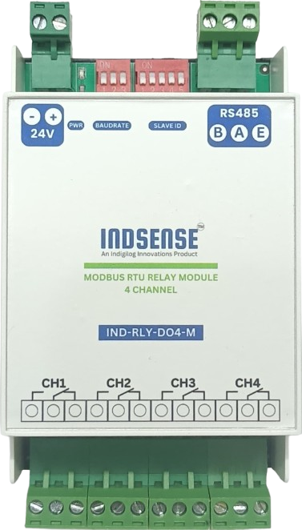

# IND-RLY-DO4-M

## Introduction  

This product is a robust **4-channel industrial relay module** designed for seamless control via the **RS485 bus**, utilizing the **Modbus RTU protocol**. Engineered for high reliability, it incorporates multiple built-in **protection mechanisms**, including **power supply isolation, magnetic isolation, a resettable fuse, and TVS diode protection** to ensure durability and stability in industrial environments.

## Interested to Buy?

