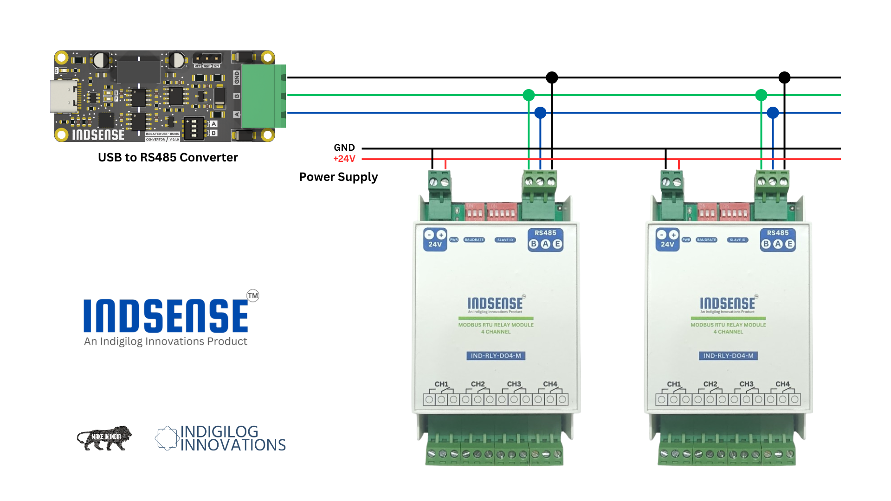
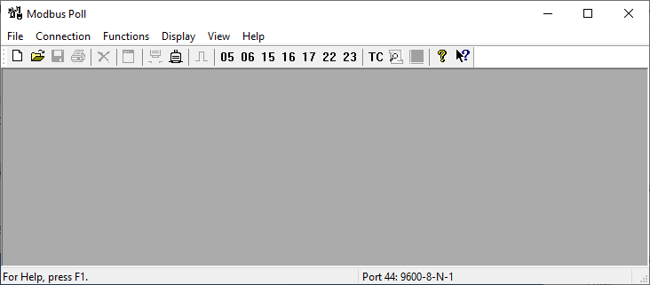
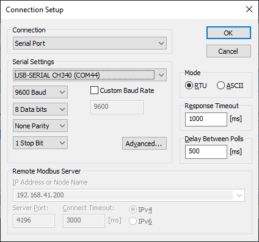
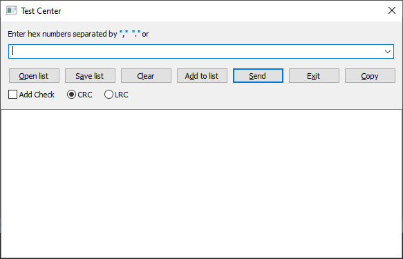

# Hardware Testing  

Follow these steps to set up and test the **4-channel industrial relay module**:  

1. **Connect the RS485 Interface**
    - Use a **USB-to-RS485 converter** to connect the module’s **RS485 port**, as shown in the reference image.  
   

2. **Set the Baud Rate**  
    - Configure the **baud rate** using the onboard **baud rate selection switch**.  
    - Refer to [Baudrate Selection](#baudrate-selection) for available options.  

3. **Set the Device ID (Slave ID)**  
    - Assign a unique **Device ID (1-32)** using the **Device ID selection switch**.  
    - Refer to [Device ID Selection](#device-id-selection) for available options.  

4. **Power the Device**  
    - Supply a **DC voltage between 5V and 24V** to the module.  
   > **⚠ Caution:** Ensure correct **polarity** and that the voltage is **within the supported range** to avoid damage.  

5. **Connect to the PC**  
    - Plug the **USB-to-RS485 converter** into your **PC**.  
    - **Power ON** the device and verify the connection.  

6. **Simulation Software**
    - Download, install, and open Modbus Master simulation software. 
    - This guide uses Modbus Poll, but any software supporting Modbus RTU protocol can be used. 
   
7. **Connecting the Simulator**
   > **Note:** The steps may vary depending on the simulation software you choose.
    - Go to Connection → Connect or press F3. This opens Connection Setup dialog box.
      
    - Select `Serial Port` from connection dropdown
    - Select the port and baudrate selected in Step 2.
    - Set Mode to `RTU` and click OK
    - Now go to Functions → Test Center. This opens the `Test Center` dialog box.
   
    - Now enter the commands to control relay, get status of the relay. Refer to [Operation Commands](#operation-protocol) for detailed command syntax.
